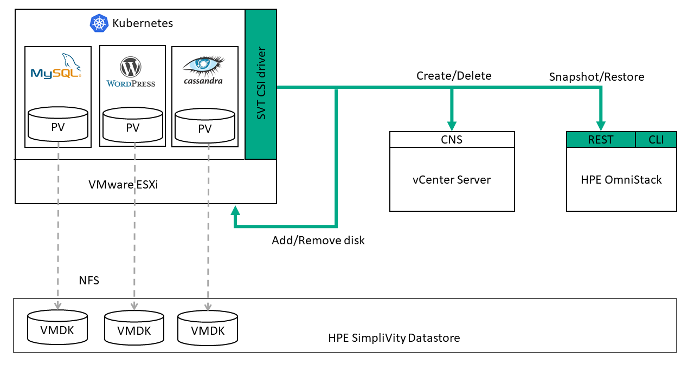

# Overview

The HPE SimpliVity Container Storage Interface (CSI) driver for vSphere enables you to provision HPE SimpliVity storage for Kubernetes applications while providing HPE SimpliVity data protection. It includes the following features:

- Snapshots
- Static and dynamic provisioning
- Read and write from a single pod

## Components

The following diagram illustrates the components in a Kubernetes cluster with the HPE SimpliVity CSI driver deployed.

- **Kubernetes cluster**: The set of Kubernetes nodes used to run containerized applications on an HPE OmniStack host.
- **HPE SimpliVity Container Storage Interface (CSI) driver**: The HPE SimpliVity software component that is responsible for provisioning persistent volumes from an existing HPE SimpliVity datastore.
- **vCenter Server CNS driver**: A vCenter Server component that enables provisioning and life cycle operations for container volumes on vSphere. The HPE SimpliVity CSI plugin uses the CNS driver to create and delete persistent volumes.
- **First Class Disk (FCD)**: An FCD is a volume that is independent of a virtual machine in VMware. The HPE SimpliVity CSI Driver uses FCDs to manage data volumes separate from Kubernetes nodes.
- **HPE OmniStack host**: An x86 server running HPE OmniStack software and VMware ESXi. To use the HPE SimpliVity CSI plugin, the HPE OmniStack host must be running VMware ESXi 6.7U3.
- **HPE SimpliVity datastore**: HPE SimpliVity datastores provide storage resources to the VMware ESXi host over the NFS protocol. A Kubernetes storage class maps persistent volume requests to an HPE SimpliVity datastore. Persistent volumes inherit the backup policy of the datastore where they are created.
- **REST API**: The HPE SimpliVity CSI plugin uses an internal REST API to create and restore persistent volume snapshots in an HPE SimpliVity datastore.
- **CLI**: The HPE SimpliVity CLI has been enhanced to support persistent volumes. You can use the CLI to create an HPE SimpliVity backup of a persistent volume (svt-pv-backup), to list the set of existing PVs (svt-pv-show) or to change the default backup policy for a PV (svt-pv-policy-set). You can also backup and restore a PV (svt-backup-show and svt-backup-restore). HPE OmniStack requires that the PV name be in the format of `pvc-<uid>_fcd`.
