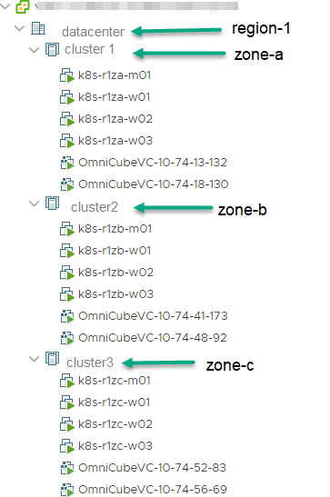

<!-- markdownlint-disable MD033 -->
<!-- markdownlint-disable MD024 -->
# Deployment with Topology for HPE SimpliVity CSI Driver for vSphere

In order to enable topology aware provisioning, you need to perform the following steps when deploying the Kubernetes cluster:

- [Set Up Zones in an HPE SimpliVity Environment](#set_up_zones_in_simplivity)
- [Enable Zones for the vSphere CPI and HPE SimpliVity CSI Driver](#enable_zones_for_cpi_and_csi)

See [Using Topologies](../using-topologies.md) for more information on when you might want to enable this feature and how to use it.

## Set Up Zones in an HPE SimpliVity Environment <a id="set_up_zones_in_simplivity"></a>

The zone configuration will depend on your HPE SimpliVity environment. A common scenario is to create a zone per HPE SimpliVity cluster as the HPE SimpliVity datastores are available to all HPE OmniStack hosts in the cluster.

In the following example, the HPE SimpliVity environment includes three clusters with Kubernetes node VMs located on all three clusters.


  
## Create Zones Using vSphere Tags

Use vSphere tags to label zones in your vSphere environment. In this example, the HPE SimpliVity environment includes three clusters: cluster1, cluster2, and cluster3. The Kubernetes node VMs are distributed across the three clusters. Category tags are created for the Kubernetes regions and zones. Then the datacenter is tagged with a region and the clusters are tagged with zones.

Make sure that you have appropriate tagging privileges that control your ability to work with tags. See [vSphere Tagging Privileges](https://docs.vmware.com/en/VMware-vSphere/7.0/com.vmware.vsphere.security.doc/GUID-2199584C-B422-4EEF-9340-5449E1FB7DAE.html) in the vSphere Security documentation.

**Note:** Ancestors of node VMs, such as host, cluster, and data center, must have the ReadOnly role set for the vSphere user configured to use the CSI driver and CCM. This is required to allow reading tags and categories to prepare nodes' topology.

1. In the vSphere Client create two tag categories that will be used for identifying regions and zones in your environment. In this example, the categories are named k8s-region and k8s-zone.

    For information, see [Create, Edit, or Delete a Tag Category](https://docs.vmware.com/en/VMware-vSphere/7.0/com.vmware.vsphere.vcenterhost.doc/GUID-BA3D1794-28F2-43F3-BCE9-3964CB207FB6.html) in the vCenter Server and Host Management documentation.

    <br>

2. Create tags for each zone and region in your environment. This example has one region and three zones (one per cluster).

    | Categories         | Tags                              |
    | :----------------- | :-------------------------------- |
    | k8s-region         |  region-1                         |
    | k8s-zone           |  zone-a, zone-b, zone-c           |

    <br>

3. Apply corresponding tags to the data center and clusters as indicated in the table.

    For information, see [Assign or Remove a Tag](https://docs.vmware.com/en/VMware-vSphere/7.0/com.vmware.vsphere.vcenterhost.doc/GUID-379F40D3-8CD6-449E-89CB-79C4E2683221.html) in the vCenter Server and Host Management documentation.

    |  Categories     |  Tags         |
    | :-------------- | :------------ |
    |  datacenter     |  region-1     |
    |  cluster1       |  zone-a       |
    |  cluster1       |  zone-b       |
    |  cluster1       |  zone-c       |

## Enable Zones for the vSphere CPI and HPE SimpliVity CSI Driver for vSphere <a id="enable_zones_for_cpi_and_csi"></a>

After creating and applying topology tags in vSphere, the next step is to install the vSphere CPI and the HPE SimpliVity CSI driver using the zone and region categories.

1. Add Labels section to cloud-config when installing the vSphere CPI.

    Add a `Labels` section to the configmap cloud-config file, specifying the category names you created for the region and zone.

    ```bash
    [Global]
    insecure-flag = "true"                # Set to true to use self-signed certificate

    [VirtualCenter "1.1.1.1"]             # vCenter IP
    insecure-flag = "true"                # Set to true to use self-signed certificate
    user = "administrator"                # Login ID
    password = "password"                 # Login Password
    port = "443"                          # vCenter Server Port, Default Port 443
    datacenters = "datacenter"            # Comma separated list of Datacenter names where Kubernetes node VMs are present.

    [Labels]
    region = k8s-region                   # vSphere category name for Kubernetes region
    zone = k8s-zone                       # vSphere category name for Kubernetes zone
    ```

2. Verify that your zones and regions are applied to the Kubernetes nodes.

    After installation, labels `failure-domain.beta.kubernetes.io/region` and `failure-domain.beta.kubernetes.io/zone` are applied to all nodes.

    ```text
    $ kubectl get nodes -L failure-domain.beta.kubernetes.io/zone -L failure-domain.beta.kubernetes.io/region
    NAME           STATUS   ROLES    AGE   VERSION   ZONE     REGION
    k8s-r1za-m01   Ready    master   13h   v1.17.5   zone-a   region-1
    k8s-r1za-w01   Ready    <none>   13h   v1.17.5   zone-a   region-1
    k8s-r1za-w02   Ready    <none>   13h   v1.17.5   zone-a   region-1
    k8s-r1za-w03   Ready    <none>   13h   v1.17.5   zone-a   region-1
    k8s-r1zb-m01   Ready    master   13h   v1.17.5   zone-b   region-1
    k8s-r1zb-w01   Ready    <none>   13h   v1.17.5   zone-b   region-1
    k8s-r1zb-w02   Ready    <none>   13h   v1.17.5   zone-b   region-1
    k8s-r1zb-w03   Ready    <none>   13h   v1.17.5   zone-b   region-1
    k8s-r1zc-m01   Ready    master   13h   v1.17.5   zone-c   region-1
    k8s-r1zc-w01   Ready    <none>   13h   v1.17.5   zone-c   region-1
    k8s-r1zc-w02   Ready    <none>   13h   v1.17.5   zone-c   region-1
    k8s-r1zc-w03   Ready    <none>   13h   v1.17.5   zone-c   region-1
    ```

3. Add Labels section to cloud-config when installing the CSI driver.

    In the credential secret file, add a `Labels` section with entries for the region and zone categories you created in vSphere.

    ```bash
    [Global]
    cluster-id = "demo-cluster-id"        # Cluster Name, Each Kubernetes cluster should have it's own unique cluster-id set in the csi-vsphere.conf file

    [VirtualCenter "1.1.1.1"]             # vCenter IP
    insecure-flag = "true"                # Set to true to use self-signed certificate
    user = "administrator"                # Login ID
    password = "password"                 # Login Password
    port = "443"                          # vCenter Server Port, Default Port 443
    datacenters = "datacenter"            # Comma separated list of Datacenter names where Kubernetes node VMs are present.

    [HPESimpliVity]
    ip = "1.1.1.2"                        # Management Virtual Appliance (MVA) IP Address or HPE SimpliVity OVC Management IP address
    user = "simplivity_user"              # Login ID of HPE SimpliVity OVC
    password = "simplivity_password"      # Password of HPE SimpliVity OVC

    [Labels]
    region = k8s-region                   # vSphere category name for Kubernetes region
    zone = k8s-zone                       # vSphere category name for Kubernetes zone
    ```

4. Make sure `external-provisioner` is deployed with the arguments `--feature-gates=Topology=true` and `--strict-topology` enabled.

    Uncomment the lines following the comment 'needed for topology aware setup' in the `svt-csi-controller-deployment.yaml` file.

5. Verify that your CSI driver installation has the topology feature enabled.

    ```text
    $ kubectl get csinodes -o jsonpath='{range .items[*]}{.metadata.name} {.spec}{"\n"}{end}'
    k8s-r1za-m01 map[drivers:<nil>]
    k8s-r1za-w01 map[drivers:[map[name:csi.simplivity.hpe.com nodeID:k8s-r1za-w01 topologyKeys:[failure-domain.beta.kubernetes.io/region failure-domain.beta.kubernetes.io/zone]]]]
    k8s-r1za-w02 map[drivers:[map[name:csi.simplivity.hpe.com nodeID:k8s-r1za-w02 topologyKeys:[failure-domain.beta.kubernetes.io/region failure-domain.beta.kubernetes.io/zone]]]]
    k8s-r1za-w03 map[drivers:[map[name:csi.simplivity.hpe.com nodeID:k8s-r1za-w03 topologyKeys:[failure-domain.beta.kubernetes.io/region failure-domain.beta.kubernetes.io/zone]]]]
    k8s-r1zb-m01 map[drivers:<nil>]
    k8s-r1zb-w01 map[drivers:[map[name:csi.simplivity.hpe.com nodeID:k8s-r1zb-w01 topologyKeys:[failure-domain.beta.kubernetes.io/region failure-domain.beta.kubernetes.io/zone]]]]
    k8s-r1zb-w02 map[drivers:[map[name:csi.simplivity.hpe.com nodeID:k8s-r1zb-w02 topologyKeys:[failure-domain.beta.kubernetes.io/region failure-domain.beta.kubernetes.io/zone]]]]
    k8s-r1zb-w03 map[drivers:[map[name:csi.simplivity.hpe.com nodeID:k8s-r1zb-w03 topologyKeys:[failure-domain.beta.kubernetes.io/region failure-domain.beta.kubernetes.io/zone]]]]
    k8s-r1zc-m01 map[drivers:<nil>]
    k8s-r1zc-w01 map[drivers:[map[name:csi.simplivity.hpe.com nodeID:k8s-r1zc-w01 topologyKeys:[failure-domain.beta.kubernetes.io/region failure-domain.beta.kubernetes.io/zone]]]]
    k8s-r1zc-w02 map[drivers:[map[name:csi.simplivity.hpe.com nodeID:k8s-r1zc-w02 topologyKeys:[failure-domain.beta.kubernetes.io/region failure-domain.beta.kubernetes.io/zone]]]]
    k8s-r1zc-w03 map[drivers:[map[name:csi.simplivity.hpe.com nodeID:k8s-r1zc-w03 topologyKeys:[failure-domain.beta.kubernetes.io/region failure-domain.beta.kubernetes.io/zone]]]]
    ```
